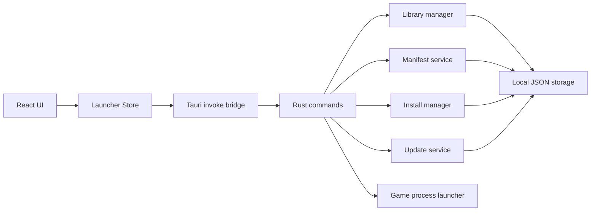

# Lumorix Launcher Architecture

## Layers

## Responsibilities

- React renders the launcher shell, setup, library, detail, downloads, settings and about views.
- `LauncherStore` centralizes UI actions and refreshes snapshots during active jobs.
- Rust commands are the only path to filesystem, download and process operations.
- Storage uses JSON files in the local app data directory for transparency and easy backup.
- Libraries are explicitly registered folders with a `.lumorix-library` marker file.
- Manifests are validated before they become visible to the UI.
- Install jobs are held in memory and reflected in snapshots for live progress.

## Local Files

Default Windows locations:

- Config: `%LOCALAPPDATA%\Lumorix Launcher\launcher-config.json`
- Installed games DB: `%LOCALAPPDATA%\Lumorix Launcher\installed-games.json`
- Cache: `%LOCALAPPDATA%\Lumorix Launcher\Cache`
- Logs: `%LOCALAPPDATA%\Lumorix Launcher\Logs`
- Additional custom manifests: `%LOCALAPPDATA%\Lumorix Launcher\Manifests`

## Safety Rules

- Library paths must be absolute and valid for Windows.
- Manifest install paths must be relative and cannot traverse outside the install root.
- Uninstall refuses to remove the library root or a path outside the owning library.
- Zip extraction uses enclosed archive paths to prevent path traversal.
- Remote archives require SHA-256 validation before extraction.
